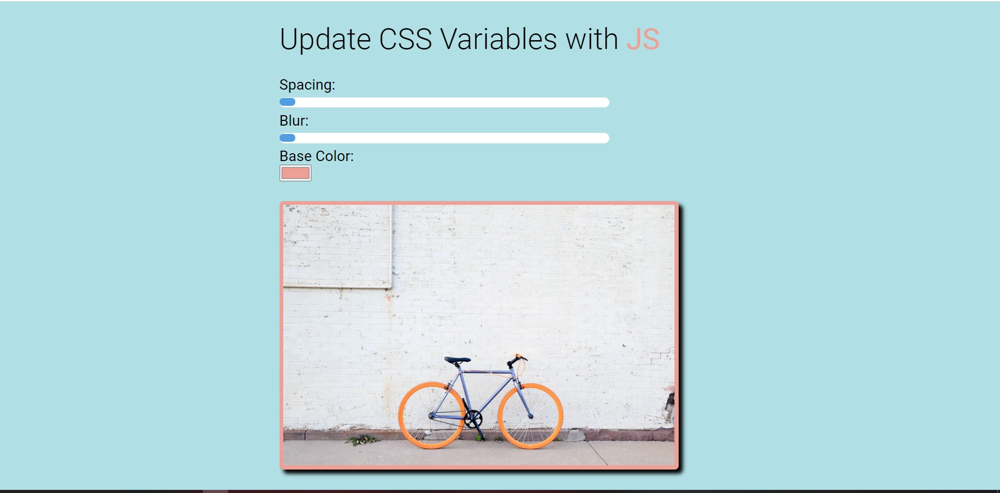

# <h1 align="center"> 👋Welcome to the World of CSS Variables🎵 👋 </h1>
CSS has variables!! I couldn't even believe it when Wes Bos said it on his 30 day JavaScript Challenge Day 3. I was so eager to make my hands dirty with those.
The challenge made my hands dirty with this awesome cool project😉
The project is about changing the CSS variables value by changing the HTML input control.

## Why Getting So Excited With Ordinary Variables?
Hold on a sec! CSS variables are no ordinary!😡 They are pure gem. You can change their values from HTML via DOM. How cool is that!😎

## Okay, What does the app does?
It actually let you add blur effect, changing background on an image by using HTML input controls.

#### Live URL
Let's see the demo 😎

Here it is: http://blur-it.surge.sh/

## Tech I Used
This app is purely made with vanilla JavaScript & raw HTML/CSS. It is to demonstrate, how easily you can make something amazing out of those core technologies.

Key topics-
+ **HTML:** I used custom data- attribute & input controls such range, color. 
+ **CSS:** For the first time in my life I used CSS variables, have got to know their naming convention, how to use them to assign value using var(), how they are different from SASS variables
+ **JS:** I used DOM manipulation to select the elements that I want to listen for any event change, later I call eventlistener on them, have got to know nodeList, have cleared some confusion with template string. 

## Attribution
+ Images are from http://unsplash.com
+ If you like this project, plz checkout Wes Bos 30 Day JavaScript. It is free and awesome.😍 Link: https://javascript30.com/
